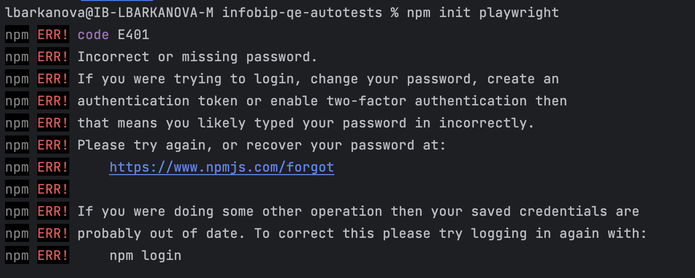
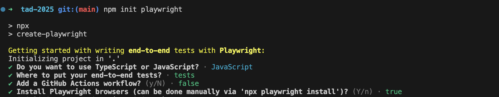

#Create project from scratch 

1. Open VS Code, create new folder
2. run `nmp init playwright`

If you face an error

run the command `npm config set registry "https://registry.npmjs.com/"` and then try again.

3. When you get promts, choose Javascript, and then click enter for default options - like on the screenshot below: 

4. Run `npm install playwright@latest -D`
Now in `tests` folder, create a `.spec.js` file with your test. 
To run it, in terminal from the `tests` folder, run `npx playwright test yourtestfilename.js --headed`
Alternatively, you can run the UI tool for Playwright: `npx playwright test --ui`

