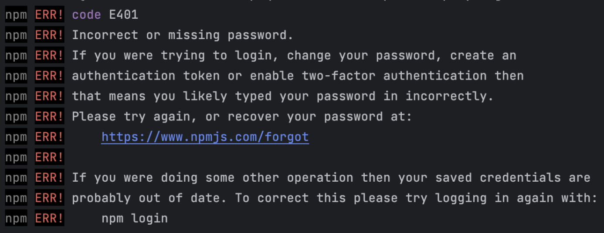

# Create Playwright project

1. Open VS Code, create new folder
2. run `nmp init playwright`

If you face an error

run the command `npm config set registry "https://registry.npmjs.com/"` and then try again.

3. When you get promts, choose Javascript, and then click enter for default options - like on the screenshot below: 


4. Run `npm install playwright@latest -D`
Now in `tests` folder, there is a `example.spec.js` file. 
To run it, in terminal from the `tests` folder, run `npx playwright test example.spec.js --headed`.
Alternatively, you can run the UI tool for Playwright: `npx playwright test --ui`.

5. Create your own `.spec.js` files with tests. 


# Setup ollama 

1. Download ollama https://ollama.com/download 

2. Install the app and open it.


3. Follow the instructions
 - `install ollama`
 - run your first model - open terminal and run `ollama run llama3.2` 

4. Once installed, you will see the prompt to send a message to LLM


5. Use `Ctrl + d` or `/bye` to exit.

6. To call LLM over API, run `ollama pull llama3.2` and then your curl: 
```bash
curl http://localhost:11434/api/generate -d '{
  "model": "llama3.2",
  "prompt": "What is the weather in Rotterdam?",
  "stream": false
}'